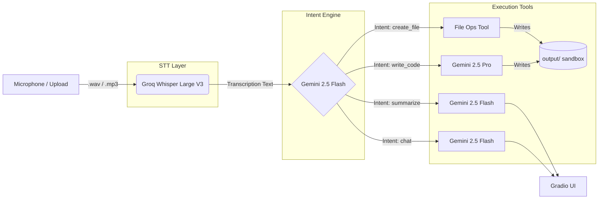

#  Voice-Controlled Local AI Agent

A production-grade voice-controlled AI agent that transcribes spoken commands, classifies intent, and executes actions — all through a clean Gradio web interface. Built for the Mem0 internship assignment.

---

## Architecture




### Pipeline Flow

1. **Audio Input** → User records via microphone or uploads a file (.wav, .mp3, .m4a)
2. **STT** → Groq Whisper Large V3 transcribes audio to text (<1s latency)
3. **Intent Classification** → Gemini 2.5 Flash parses text into structured intent + parameters
4. **Human-in-the-Loop** → Optional confirmation step for destructive operations (file writes)
5. **Tool Execution** → Routed to the correct tool function based on classified intent
6. **Output** → Results displayed in the Gradio UI; files written to sandboxed `output/` directory

---

## Hardware & Model Decisions

### Why Groq API for STT (not local Whisper)

Running Whisper Large V3 locally is impractical for a real-time voice agent:

| Factor | Local Whisper Large V3 | Groq API |
|--------|----------------------|----------|
| **VRAM Required** | 10GB+ (fp16) | 0 (cloud) |
| **Latency** | 15-30s on M1/M2 MacBook | <1s |
| **CPU Fallback** | 45-90s (unusable) | N/A |
| **Accuracy (WER)** | Identical | Identical |
| **Setup** | ffmpeg + torch + model download (~3GB) | API key only |

**Verdict:** Local Whisper makes real-time voice interaction impossible on standard hardware. The Groq LPU delivers the same Whisper Large V3 model at 50-100x faster inference with zero local compute. For a voice-first UX, API latency IS the product.

### Why Gemini 2.5 Flash for Intent Classification

- **Latency:** ~400ms for structured JSON output — critical for responsive voice UX
- **JSON reliability:** Flash consistently produces well-formed JSON when configured with `response_mime_type="application/json"`
- **Cost:** Exceptional performance-to-cost ratio, highly affordable for production operations.
- **Accuracy:** Intent classification is a constrained task (4 categories) — Flash's reasoning is sufficient

### Why Gemini 2.5 Pro for Code Generation

- **Deeper reasoning:** Code generation requires understanding of best practices, edge cases, type systems
- **Quality bar:** Pro produces significantly better docstrings, error handling, and idiomatic code
- **Latency acceptable:** Human-in-the-Loop confirmation means the user is already pausing to review — Pro's latency is invisible in this flow
- **When it matters:** Pro is ONLY invoked for `write_code` intent, not for every request

---

## Setup Instructions

### Prerequisites

- Python 3.10+
- A [Groq API key](https://console.groq.com/keys) (free tier available)
- A [Google AI Studio API Key](https://aistudio.google.com/app/apikey) (for Gemini 2.5 models)

### Step-by-step

```bash
# 1. Clone the repository
git clone https://github.com/RohanSinghJaglan/mem_voice_ai_agent.git
cd mem_voice_ai_agent

# 2. Create a virtual environment
python3 -m venv venv
source venv/bin/activate  # On Windows: venv\Scripts\activate

# 3. Install dependencies
pip install -r requirements.txt

# 4. Configure environment variables
cp .env.example .env
# Edit .env with your actual keys:
#   GROQ_API_KEY=gsk_...
#   GEMINI_API_KEY=AIza...

# 5. Launch the agent
python main.py
# → Open http://localhost:7860 in your browser
```

---

## Supported Intents

| Intent | Example Phrase | Action | Model Used |
|--------|---------------|--------|------------|
| `create_file` | "Create a text file called notes.txt with hello world" | Writes file to `output/notes.txt` | — |
| `write_code` | "Write a Python function that reverses a string" | Generates code → `output/generated.py` | Gemini 2.5 Pro |
| `summarize` | "Summarize: Machine learning is a subset of AI that focuses on learning from data" | Returns bullet-point summary | Gemini 2.5 Flash |
| `chat` | "What is the difference between RAM and ROM?" | Conversational response with 5-turn memory | Gemini 2.5 Flash |

---

## Security & Architecture Features

### 🔒 Human-in-the-Loop Confirmation
Destructive operations (`create_file`, `write_code`) require explicit user confirmation when the checkbox is enabled. The classified intent and parameters are displayed for review before any file is written.

### 🛡️ Graceful Degradation & Hardening
Every pipeline stage has independent error and security handling:
- **Audio Overload:** Blocks large audio files (>25MB) client-side before sending to Groq.
- **API Guardrails:** Enforced `30s` timeout across all API calls to prevent hanging UI threads.
- **STT fails?** → Clear logging, pipeline stops cleanly.
- **Intent classification fails?** → Handles empty responses and schema crashes by falling back to the safe `chat` intent.
- **Validation:** Provides UI warning if classification confidence drops below 50%.

### 🔗 Compound Command Detection
The intent classifier detects multi-action commands (e.g., "create a file and then write code in it") and sets a `compound` flag in parameters, classifying based on the primary action.

### 💬 Session Chat History
The `chat` intent maintains the last 5 conversation turns in memory, scoped to MAX_CHAT_HISTORY, enabling coherent dialogue without exposing the app to memory-based denial of service.

### 📁 Strict Path Traversal Protection
All file operations pass through an aggressive `safe_path()` pipeline which normalizes separators, drops null-bytes, eliminates `../` traversals aggressively with `os.path.normpath`, and ultimately blocks writes entirely if the resulting absolute path manages to escape the trailing `/output/` sandbox.

---

## Challenges & Solutions

### 1. Robust JSON Parsing from LLM Responses
**Challenge:** Initially, LLMs often wrapped JSON responses in markdown code fences despite explicit instructions, and sometimes cutoff output mid-way yielding `json.JSONDecodeError`.

**Solution:** Switched the Gemini 2.5 generation config explicitly to `response_mime_type="application/json"`. The backend is now guaranteed to provide a rigorously validated JSON schema directly out of the generation pipeline, drastically reducing latency and failures.

### 2. Transition from GCP to Google AI Studio
**Challenge:** Using Vertex AI (`google-cloud-aiplatform`) involved opaque auth strategies (service-account keys, application-default) that were heavy and frequently threw uncaught quota failures. 

**Solution:** Completely migrated to the `google-generativeai` lightweight SDK pointing to Google AI Studio. This unified the system around a single `GEMINI_API_KEY` simplifying setup, whilst providing access to the absolute latest (Gemini 2.5) models.

### 3. Code Block Stripping for Generated Code
**Challenge:** When Gemini Pro generates code, it wraps the output in ` ```python ... ``` ` blocks. Writing this directly to a file creates invalid syntax with the fence markers included.

**Solution:** `_strip_code_blocks()` in `tools.py` uses a two-pass approach — first trying to match the full ` ```lang\n...\n``` ` pattern, then falling back to stripping leading/trailing fences. This handles edge cases like nested code blocks in generated code.

### 4. Gradio State Management for Human-in-the-Loop
**Challenge:** Gradio's event-driven model doesn't natively support "pause and wait for confirmation" workflows. The `process_audio` function needs to return partial results, store state, and resume later.

**Solution:** Used `gr.State` to persist the classified intent between button clicks. The `process_audio` function stores `intent_data` in state and shows the confirm button; `confirm_execution` reads from state and executes. The confirm button's visibility is toggled via `gr.update(visible=...)`.

---

## Project Structure

```
.
├── main.py              # Gradio UI and pipeline orchestration
├── stt.py               # Groq Whisper Large V3 transcription
├── intent.py            # Gemini 2.5 Flash intent classification
├── tools.py             # Tool execution (file ops, code gen, chat)
├── config.py            # Environment config and validation
├── output/              # Sandboxed directory for generated files
│   └── .gitkeep
├── requirements.txt     # Pinned Python dependencies
├── .env.example         # Environment variable template
├── .gitignore           # Git exclusions
└── README.md            # This file
```

---
